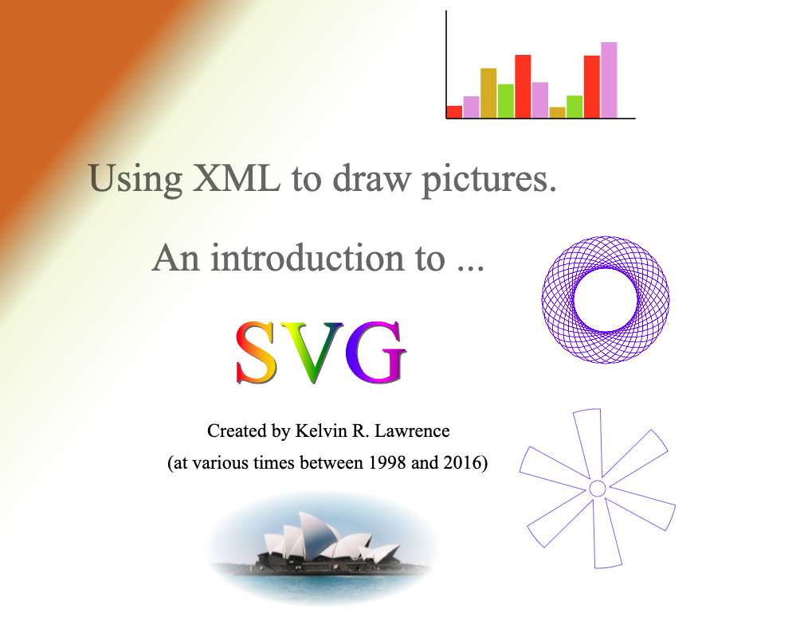

# SVG Samples and Tools

This repository contains a large number of SVG examples created between 1989 and 2016. You will also find Ruby scripts and other tools that were used to create many of them. All of the examples can be previewed by [here](https://kelvinlawrence.net/svg/).

## What is SVG?
SVG, short for "Scalable Vector Graphics", is an XML markup language designed for bringing 2D artwork and drawings to the Web and other places. As well as vector graphics (lines, circles, paths, etc.) SVG supports text, images, animation, scripting, colors, gradients, filter effects and CSS styling.  It is a very rich (declarative) graphics language which can be just as easily hand coded or machine generated.
      
## My involvement with SVG
Back in 1998/9 and the years following I became very active in the SVG community. As far as I know, I was the author of the first known SVG rendering engine back then which I
wrote in Java using the new (at the time) Java 2D API. I was also a very active member of the SVG Working group at W3C that produced the [SVG 1.0
Specification](http://www.w3.org/TR/SVG10/) .  Over the years I have compiled a large collection of my own SVG test cases and examples and used them in lectures about SVG at
various conferences around the World. The eventual adoption of SVG by the major Web browsers, both on traditional desktop computers and on mobile devices, as well as many
people asking me about my examples, prompted me to collect everything into one place. 

## About the examples
These examples are not meant to be works of art, I would by no means claim to be an artist. I view them more as a learning aid.  You will find most of the major SVG features
used somewhere in these files. If you are interested in learning a bit more about the power and ease of use of SVG, I encourage you to look at the source for the files as well
as the "artwork" as some pictures may look the same but might have been created using different SVG techniques.

With a few exceptions, all of the examples were either hand coded (by me) or produced using Ruby scripts I created to generate SVG output. One or two of the examples were
produced using Inkscape. The `examples` folder contains over 900 SVG, HTML and JPG files. If you want to view the files in a browser you can either navigate to [this webpage](https://kelvinlawrence.net/svg/) or download the contents of the `examples` folder along with the contents of the `webpage` folder and open the `index.html` file in your browser.

## Ruby scripts and other files
In the `/lib` folder there is a Ruby class, `SVGTools.rb` that provides a set of helper methods used by many of the scripts in the `generators` folder. The `webpage` folder contains the structural HTML files needed to view all of the examples, along with an alphabetical index, in a browser. Most of the examples were tested using the Google Chrome browser but should also work, for the most part, in other browsers. SVG support across browsers remains a little inconsistent. Also in the `webpage` folder, is a Ruby script called `makeindex2.rb` that can be used to generate the `index2.html` file should it ever need rebuilding. The Ruby scripts could be updated to use more idiomatic Ruby but back when I created many of them I was just starting to experiment with Ruby as an alternative to Python and Perl, and definitely had not gained the understanding of the language that I have now.

While some of the files date back as far as 1998, the examples were first published in 2013 with incremental additions made through the end of 2016. This repository was mainly created to give all the examples and scripts a safer place to live than a personal web site.

## Happy SVG-ing

I hope that this material is of interest and useful. I certainly had fun walking down memory lane while putting it together.
